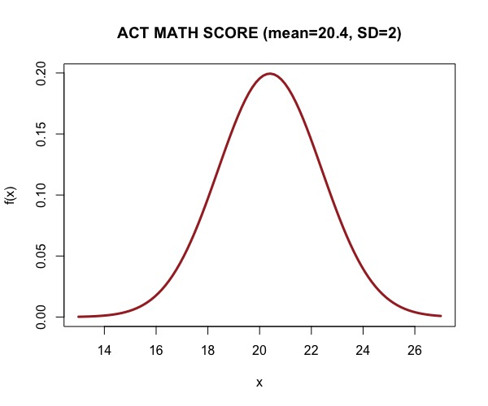

```{r setup, include=FALSE}
knitr::opts_chunk$set(echo = TRUE)
```
```{css float-right-figure-caption, echo = FALSE}
.my-right-figure {
  display: table;
  float: right;
  padding-left: 30px;
  padding-bottom: 10px;
}
.my-right-figure p {
  display: table-caption;
  caption-side: bottom;
  padding-left: 30px
}
.figure {
  display: contents;
}
```

```{css float-left-figure-caption, echo = FALSE}
.my-left-figure {
  display: table;
  float: left;
  padding-right: 30px;
  padding-bottom: 10px;
}
.my-left-figure p {
  display: table-caption;
  caption-side: bottom;
  padding-right: 30px
}
.figure {
  display: contents;
}
```

<div class="my-right-figure">
```{r echo=FALSE, fig.cap="The Normal distribution that models the ACT MATH Scores in 2020.", out.width='110%', fig.align='right'}

```
</div>

The primary topic of last week's classes was the calculation of probabilities under a normal distribution. It's important to note that the normal distribution is characterized by two parameters: the mean, denoted as $\mu$, and the standard deviation, denoted as $\sigma$. Therefore, when a random variable follows a normal distribution with a specific mean $\mu$ and standard deviation $\sigma$ (i.e., variance $\sigma^2$), we use the following notation: $X\sim \mathbf{N}(\mu,\sigma^2)$

Now let us discuss a concrete example. According to the American College Test (ACT) Math, results from the 2020 Testing found that students had a mean math score of 20.4 with standard deviation 2.0. Based on the result, we can assume the distribution of the scores is normally distributed. 

Please answer the following questions using hand calculations as well as [**Minitab**](https://app.minitab.com/). Our TA will provide guidance on how to calculate the probabilities.

1. Calculate the probability that a randomly selected student has an ACT math score less than 18.5. Also, specify the probability (area) under the normal distribution using Minitab.
   
2. Calculate the probability that a randomly selected student has an ACT score greater than 24.5. Also, specify the probability (area) under the normal distribution using Minitab.
   
3. Calculate the probability that a randomly selected student has an ACT math score between 18.4 and 23.8. Also, specify the probability (area) under the normal distribution using Minitab.


   

